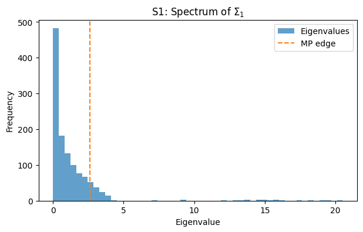
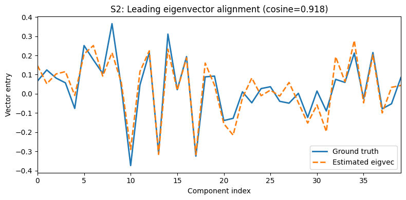
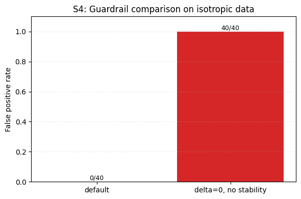
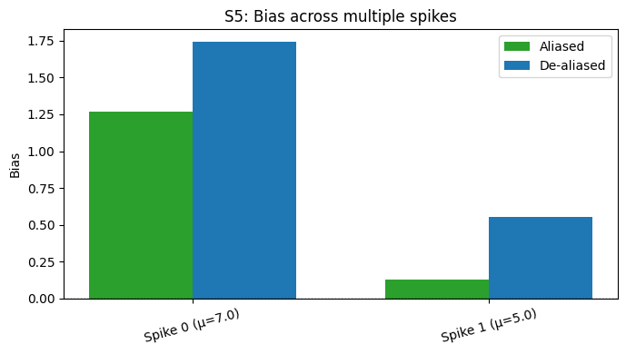
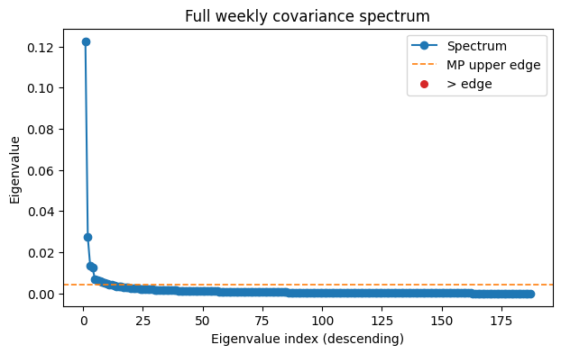
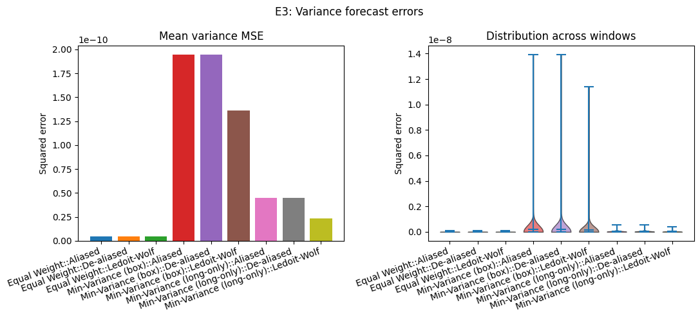
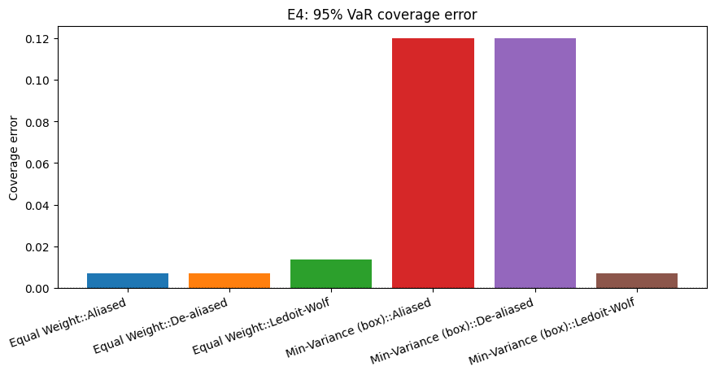
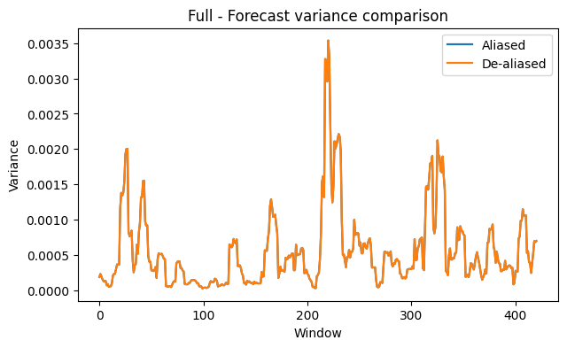
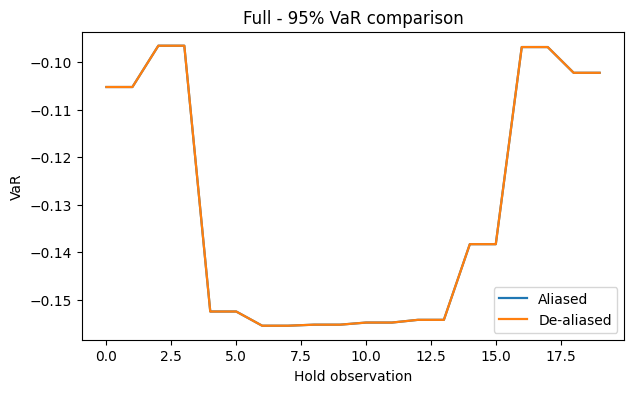

# fjs-dealias-portfolio

De-aliasing the spurious spikes that arise when MANOVA spectra are aliased in high-dimensional regimes yields materially better out-of-sample covariance and risk forecasts than Ledoit–Wolf shrinkage, enabling more reliable portfolio design under market noise. In a balanced one-way design with \(J\) daily replicates per week, the weekly risk of a portfolio with weights \(w\) decomposes into

\[
\mathbb{V}\!\left[\sum_{j=1}^J w^\top r_j\right] = J^2 w^\top \widehat{\Sigma}_1 w + J\, w^\top \widehat{\Sigma}_2 w,
\]

highlighting why both the aliased and de-aliased estimators must target the same \(\widehat{\Sigma}_1, \widehat{\Sigma}_2\) components even when we correct the spike magnitudes.

## Quickstart

1. Create and activate a virtual environment:
   ```bash
   python -m venv .venv
   source .venv/bin/activate
   ```
2. Install project and tooling:
   ```bash
   make setup
   ```
3. Regenerate the synthetic evidence suite (S1/S2/S3/S4/S5):
   ```bash
   make run-synth
   ```
4. Reproduce the rolling equity experiment:
   ```bash
   make run-equity
   ```

`make test` remains available to run the full pytest suite; `make fmt` / `make lint` apply formatting and static checks.

## Methods at a glance

- **Balanced MANOVA decomposition:** weekly returns are partitioned into between-group (`\(\widehat{\Sigma}_1\)`) and within-group (`\(\widehat{\Sigma}_2\)`) mean squares using `fjs.balanced.mean_squares`.
- **t-vector acceptance:** spikes are accepted only when the Marchenko–Pastur t-vector has dominant support on the target component, ensuring `\(\hat{\mu} = \hat{\lambda} / t_r\)` remains self-consistent. A relative δ buffer `dealias_delta_frac` can be used to scale the MP edge decision by a fraction of the edge.
- **Guardrails:** candidates must clear an MP edge buffer (`δ`), survive angular perturbations (`η`), and win cluster merges based on stability margin.
- **Risk forecasting:** detected spikes are substituted into `\(\widehat{\Sigma}_1\)` before recombining weekly covariance for equal-weight and box-constrained min-variance portfolios; Ledoit–Wolf provides the shrinkage baseline.

## Configuration & CLI flags

| Option | Default | Description |
| --- | --- | --- |
| `dealias_delta` | `0.3` | Safety buffer added to the MP edge before accepting eigenvalue outliers. |
| `dealias_eps` | `0.05` | Minimum absolute t-vector mass for the target component and tolerance for off-target entries. |
| `stability_eta_deg` | `1.0` | Angular perturbation (in degrees) applied when checking directional stability. |
| `dealias_delta_frac` | `None` | Relative δ buffer as a fraction of the MP edge (e.g., 0.05 → 5%). Overrides `dealias_delta` when set. |
| `signed_a` | `True` | Search both positive and negative `a` directions (recommended for equity). |
| `cs_drop_top_frac` | `0.1` | Fraction of top eigenvalues dropped when estimating Cs from mean squares. |
| `--sigma-ablation` | `False` | When passed to `experiments/equity_panel/run.py`, perturbs empirical Cs by ±10% and records detection robustness. |
| `--crisis "YYYY-MM-DD:YYYY-MM-DD"` | `None` | Restrict the equity run to a crisis window; results are written to `outputs/crisis_*`. |
| `--config path/to/config.yaml` | — | Override defaults for data paths, horizons, or delta/eps/eta settings. |

The equity configuration file (`experiments/equity_panel/config.yaml`) mirrors these keys; adding `dealias_delta`, `dealias_delta_frac`, `signed_a`, `cs_drop_top_frac`, `dealias_eps`, or `stability_eta_deg` entries will override the defaults above.

## Figure gallery

- **Synthetic suite:**  
  `figures/synthetic/s1_histogram.(png|pdf)` – spectrum of \(\widehat{\Sigma}_1\).  
  `figures/synthetic/s2_vectors.(png|pdf)` – alignment of the recovered eigvector with the planted spike.  
  `figures/synthetic/s4_guardrails.(csv|png|pdf)` – false-positive rates with and without guardrails.  
  `figures/synthetic/s5_multispike.(csv|png|pdf)` – aliased vs de-aliased bias across multiple spikes.  
  `figures/synthetic/bias_table.csv`, `figures/synthetic/summary.json` – tabulated S1–S5 metrics.

- **Equity panel:**  
  `experiments/equity_panel/outputs/E3_variance_mse.(png|pdf)` – variance forecast MSE comparison.  
  `experiments/equity_panel/outputs/E4_var95_coverage_error.(png|pdf)` – VaR coverage error bars.  
  `experiments/equity_panel/outputs/rolling_results.csv`, `metrics_summary.csv`, `summary.json` – per-window diagnostics (`n_detections`, forecasts, realised risk).

Running `make run-synth` and `make run-equity` is sufficient to refresh the full gallery.

### Embedded previews

Note: The paths below point to locally generated artefacts. We now publish the fast synthetic previews (figures/synthetic_fast) so they render on GitHub. Equity outputs remain local by default unless explicitly committed.

#### Synthetic suite (fast)

S1 — Spectrum of \(\widehat{\Sigma}_1\)



S2 — Leading eigenvector vs. planted spike



S4 — Guardrail false-positive comparison



S5 — Multi-spike bias (aliased vs. de-aliased)



#### Equity panel

E1 — Weekly covariance spectrum (fit window)



E3 — Variance forecast MSE



E4 — 95% VaR coverage error



Rolling overlays — variance and VaR forecasts (baseline vs. de-aliased)





## Matching targets across estimators

Both the aliased estimator and the de-aliased spike reconstructions are calibrated against the same weekly covariance components. We first compute the balanced MANOVA mean squares \(\widehat{\text{MS}}_1, \widehat{\text{MS}}_2\), then build the weekly covariance through

\[
\widehat{\Sigma}_\text{weekly} = J^2 \widehat{\Sigma}_1 + J \widehat{\Sigma}_2,\qquad \widehat{\Sigma}_1 = \frac{\widehat{\text{MS}}_1 - \widehat{\text{MS}}_2}{J},\quad \widehat{\Sigma}_2 = \widehat{\text{MS}}_2.
\]

De-aliasing only substitutes selected spike magnitudes in \(\widehat{\Sigma}_1\); \(\widehat{\Sigma}_2\) and the aggregation to weekly risk remain unchanged, guaranteeing both paths forecast the same quantity before and after spike adjustments. Ledoit–Wolf operates on the same balanced weekly returns, providing a shrinkage baseline against the identical target.

## Guardrails during de-aliasing

- **δ-buffer:** candidate spikes must exceed the Marčenko–Pastur bulk edge plus a safety buffer before they are considered.
- **Angular stability:** every accepted spike must persist when the search direction \(a\) is rotated by ±η degrees.
- **Cluster merge:** detections with nearby \(\hat{\mu}\) values are merged; the most stable representative is kept.

## Citation

Fan, J., Johnstone, I. M., & Sun, Q. (2018). Eigenvalue shrinkage estimation of large covariance matrices. *Journal of the Royal Statistical Society: Series B (Statistical Methodology)*.
