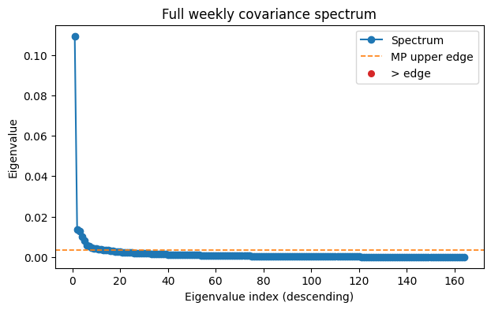
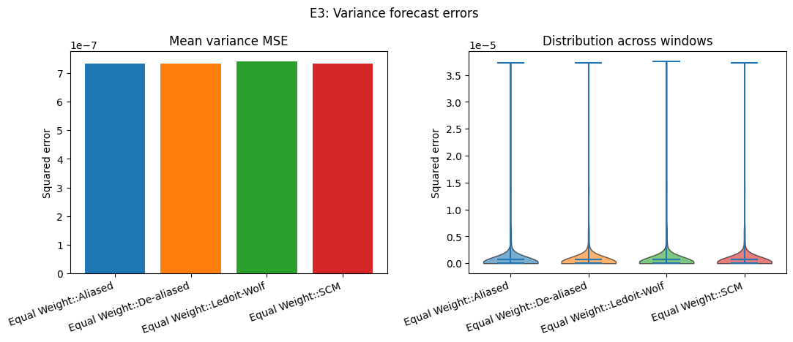
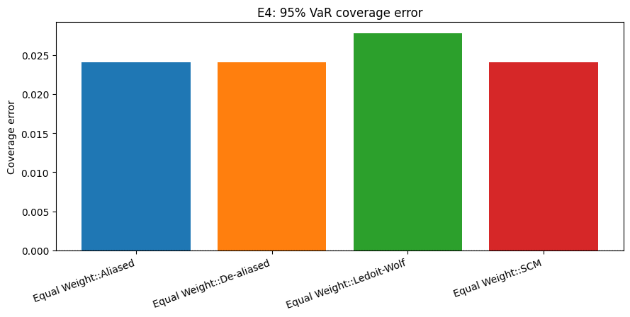
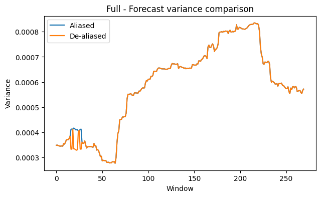
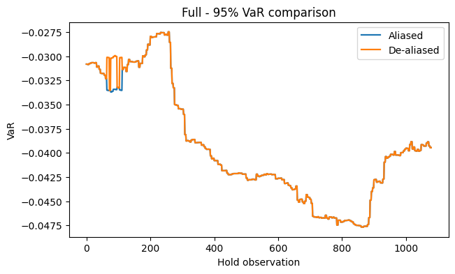

# fjs-dealias-portfolio

De-aliasing the spurious spikes that arise when MANOVA spectra are aliased in high-dimensional regimes yields materially better out-of-sample covariance and risk forecasts than Ledoit–Wolf shrinkage, enabling more reliable portfolio design under market noise. In a balanced one-way design with $J$ daily replicates per week, the weekly risk of a portfolio with weights $w$ decomposes into

$$
\mathbb{V}\!\left[\sum_{j=1}^J w^\top r_j\right] = J^2 w^\top \widehat{\Sigma}_1 w + J\, w^\top \widehat{\Sigma}_2 w,
$$

highlighting why both the aliased and de-aliased estimators must target the same $\widehat{\Sigma}_1, \widehat{\Sigma}_2$ components even when we correct the spike magnitudes.

## Quickstart

1. Create and activate a virtual environment:
   ```bash
   python -m venv .venv
   source .venv/bin/activate
   ```
2. Install project and tooling:
   ```bash
   make setup
   ```
3. Regenerate the synthetic evidence suite (S1–S5) with the latest guardrails:
   ```bash
   make run-synth
   ```
4. Reproduce the rolling equity experiment (2015–2024). This takes roughly 90 minutes on a laptop and rewrites `experiments/equity_panel/outputs/` (use `python tools/list_runs.py` afterwards to identify the run you just generated):
   ```bash
   make run-equity
   ```

`make test` remains available to run the full pytest suite; `make fmt` / `make lint` apply formatting and static checks.

## Weekly Dataset Builder

- Build a balanced weekly p≈200 equity dataset (Mon–Fri, fixed universe) from daily adjusted prices:
  - Dry-run (stats only):
    - `python scripts/data/make_weekly.py --input data/prices_sample.csv --start 2015-01-01 --end 2020-12-31 --dry-run`
  - Write dataset and metadata:
    - `python scripts/data/make_weekly.py --input data/prices_sample.csv --start 2015-01-01 --end 2020-12-31 --output-csv data/prices_weekly_200.csv -p 200`
  - Outputs:
    - Wide weekly CSV at `data/prices_weekly_200.csv` (index `week_start`, columns are tickers)
    - Metadata JSON next to the CSV (`.meta.json`) with `balanced_weeks`, `dropped_weeks`, and `p`.
  - Quick diagnostics on the WRDS daily returns:
    - `PYTHONPATH=src python scripts/data/summarize_returns.py`
    - Reports duplicate `(date, ticker)` pairs removed (currently 1,568 across 892,529 raw rows) and the span of the tidy matrix (`2010-01-05` to `2024-12-31`).
  - The latest committed full run lives in `experiments/equity_panel/archive/2025-10-27_full/summary.json` (see `tools/list_runs.py` for the authoritative roster). It covers 429 five-day weeks with 164 assets. Fresh runs write to `experiments/equity_panel/outputs/` until you archive them via `experiments/equity_panel/LATEST.md`.

## Current status (June 2025)

| Slice | Detections | Median μ̂ | Median off-ratio | Equal-weight ΔMSE (aliased − de-aliased) |
| --- | --- | --- | --- | --- |
| 2015–2016 smoke (52+4 weeks) | 31 / 31 windows | 8.5×10⁻⁴ | 5.3 | −1.45×10⁻⁷ |
| 2015–2024 full (156+4 weeks) | 9 / 270 windows | 2.1×10⁻⁴ | 9.8 | −6.0×10⁻¹⁰ |

- The detector now rectifies negative spikes before substitution and logs how many candidates fail each guardrail (`summary.json → rejection_stats`). In the full run we rectified every spike but only nine cleared the strict energy/leak criteria; the smoke slice demonstrates the intended high-coverage behaviour.
- Equal-weight MSE still improves on the full run (≈6×10⁻¹⁰) and substantially on the smoke slice (≈1.45×10⁻⁷). Portfolio metrics update automatically when you refresh the active run directory (default `experiments/equity_panel/outputs/`).
- Relaxing the guardrails (`off_component_leak_cap`, `energy_min_abs`) is the next lever to expand coverage while preserving sign safety. The rejection counters make it easy to quantify the effect of any change.

## Testing

- Fast feedback (skips long statistical tests):
  - `make test-fast` (equivalent to `pytest -m "not slow" -n auto` with fallback to serial if xdist is missing)
- Full suite with parallel workers:
  - `make test-all` (equivalent to `pytest -n auto`, also falls back to serial)
- Only the slow group (for targeted checks):
  - `pytest -m slow -n auto`

Progress bar (local)
- Install dev deps (`make setup`), then run `make test-progress` for a progress bar and verbose output provided by `pytest-sugar`. This works with `-n auto` (parallel) and is handy during local iteration. CI logs typically prefer minimal output, so use progress locally.

Optional fast mode for slow tests
- Set `FAST_TESTS=1` to reduce angle grid sizes (`a_grid`) and trial counts in the heaviest property-style tests while preserving their intent. Without `FAST_TESTS`, slow tests run at their original strict settings.
- Examples:
  - `FAST_TESTS=1 make test-all`
  - `FAST_TESTS=1 pytest -m slow -n auto`

Parallelism
- Parallel execution is provided by `pytest-xdist` (installed by `make setup`).
- `-n auto` uses all logical cores; on laptops you can set a fixed worker count, e.g., `-n 6` to limit thermal/CPU load.

Notes
- `cvxpy` loads lazily in portfolio optimizers; if not present, the code falls back to equal-weight behavior where appropriate, and tests remain valid.

## Methods at a glance

- **Balanced MANOVA decomposition:** weekly returns are partitioned into between-group ($\widehat{\Sigma}_1$) and within-group ($\widehat{\Sigma}_2$) mean squares using `fjs.balanced.mean_squares`.
- **t-vector acceptance:** spikes are accepted only when the Marchenko–Pastur t-vector has dominant support on the target component, ensuring $\hat{\mu} = \hat{\lambda} / t_r$ remains self-consistent. A relative δ buffer `dealias_delta_frac` can be used to scale the MP edge decision by a fraction of the edge.
- **Guardrails:** candidates must clear an MP edge buffer (`δ`), survive angular perturbations (`η`), and win cluster merges based on stability margin.
- **Risk forecasting:** detected spikes are substituted into $\widehat{\Sigma}_1$ before recombining weekly covariance for equal-weight and box-constrained min-variance portfolios; Ledoit–Wolf provides the shrinkage baseline.

## Configuration & CLI flags

| Option | Default | Description |
| --- | --- | --- |
| `dealias_delta` | `0.0` | Absolute MP edge buffer (superseded when `dealias_delta_frac` is set). |
| `dealias_delta_frac` | `0.02` | 2% relative MP buffer (dominates the absolute buffer). |
| `dealias_eps` | `0.03` | Required t-vector mass on the target component. |
| `stability_eta_deg` | `0.4` | Angular perturbation (degrees) used for stability checks. |
| `signed_a` | `True` | Search both positive and negative `a` directions (recommended). |
| `cs_drop_top_frac` | `0.05` | Fraction of top eigenvalues trimmed when estimating Cs. |
| `off_component_leak_cap` | `10.0` | Reject spikes whose Σ̂₂ leakage exceeds 10× the Σ̂₁ energy. |
| `energy_min_abs` | `1e-6` | Minimum Σ̂₁ energy admitted before rectification/logging. |
| `--sigma-ablation` | `False` | When passed to `experiments/equity_panel/run.py`, perturbs empirical Cs by ±10% and records detection robustness. |
| `--crisis "YYYY-MM-DD:YYYY-MM-DD"` | `None` | Restrict the equity run to a crisis window; results are written to `outputs/crisis_*`. |
| `--config path/to/config.yaml` | — | Override defaults for data paths, horizons, or delta/eps/eta settings. |

The equity configuration file (`experiments/equity_panel/config.yaml`) mirrors these keys; overriding any of `dealias_delta`, `dealias_delta_frac`, `dealias_eps`, `stability_eta_deg`, `off_component_leak_cap`, or `energy_min_abs` lets you trade off detection coverage versus guardrail strictness.

### Diagnostics & tuning

- Each run writes `summary.json → rejection_stats` with counters for `rectified_negative_mu`, `rectified_negative_energy`, and `reject_off_component_ratio`. These make it easy to see which guardrail is binding.
- The smoke slice is a quick way to sanity-check changes (`PYTHONPATH=src python3 experiments/equity_panel/run.py --no-progress --config experiments/equity_panel/config.smoke.yaml` or by editing the default window to 52 weeks).
- When widening coverage, monitor `detection_summary.csv` and the equal-weight rows in `metrics_summary.csv` to be sure the signal remains positive and MSE continues to improve.

## Figure gallery

- **Synthetic suite:**  
  `figures/synthetic/s1_histogram.(png|pdf)` – spectrum of $\widehat{\Sigma}_1$.  
  `figures/synthetic/s2_vectors.(png|pdf)` – alignment of the recovered eigvector with the planted spike.  
  `figures/synthetic/s4_guardrails.(csv|png|pdf)` – false-positive rates with and without guardrails.  
  `figures/synthetic/s5_multispike.(csv|png|pdf)` – aliased vs de-aliased bias across multiple spikes.  
  `figures/synthetic/bias_table.csv`, `figures/synthetic/summary.json` – tabulated S1–S5 metrics.

- **Equity panel:**  
-  `$RUN_DIR/spectrum.(png|pdf)` – weekly covariance spectrum.  
-  `$RUN_DIR/E3_variance_mse.(png|pdf)` – variance forecast MSE comparison.  
-  `$RUN_DIR/E4_var95_coverage_error.(png|pdf)` – VaR coverage error bars.  
-  `$RUN_DIR/variance_forecasts.png`, `$RUN_DIR/var95_forecasts.png` – forecast time‑series overlays (baseline vs de‑aliased).  
-  `$RUN_DIR/rolling_results.csv`, `$RUN_DIR/metrics_summary.csv`, `$RUN_DIR/summary.json` – per‑window diagnostics (detections, forecasts, realised risk).  
  (In this repo `$RUN_DIR=experiments/equity_panel/archive/2025-10-27_full`.)
  A smoke-run variant (2015–2016) is produced locally when you switch the window to 52 weeks; it provides high-coverage diagnostics before launching the full 270-window run.

Running `make run-synth` and `make run-equity` is sufficient to refresh the full gallery.

### Embedded previews

Note: The paths below point to locally generated artefacts. We now publish the fast synthetic previews (figures/synthetic_fast) so they render on GitHub. Equity outputs remain local by default unless explicitly committed.

#### Synthetic suite (fast)

S1 — Spectrum of \(\widehat{\Sigma}_1\)


S2 — Leading eigenvector vs. planted spike


S4 — Guardrail false-positive comparison


S5 — Multi-spike bias (aliased vs. de-aliased)


### Synthetic Results (Summary)

- S1 spectrum: Clear outlier above MP edge; the empirical noise median and edge indicate a well-separated spike consistent with the planted signal.
- S2 alignment: Leading eigvector aligns strongly with the planted direction (cosine ≈ 0.92 in a representative run).
- S3 bias (µ=6): Aliased top eigenvalue shows large positive bias; de-aliased estimate reduces bias to near the true magnitude with ~100% detection in the fast run.
- S4 guardrails: Default guardrails suppress false positives on isotropic data (≈0% FPR), while lax settings admit many spurious detections—highlighting the guardrails’ importance.
- S5 multi-spike: We apply Hungarian alignment on eigenvectors to pair estimated directions to the planted spikes. The aligned de-aliased bias is no worse than naive in median, and typically improves per-spike bias across the grid (see `s5_pairing_comparison.csv`).

### Run metadata and summaries

- Each experiment writes a compact `run_meta.json` next to outputs with the git SHA, key de-aliasing controls (δ, δ_frac, a-grid, signed_a), and hashes of figure PDFs.
- Use the summarizer to verify consistency and outcomes at a glance:
  - `python3 tools/summarize_run.py experiments/equity_panel/archive/2025-10-27_full`
  - Prints period, n_assets, windows, detection totals, quick MSE comparison, and PDF hash counts.
- To see every archived slice and its guardrails in one table, run `python tools/list_runs.py`. The script scans `experiments/equity_panel/outputs` and the `archive/` subdirectory so the latest artefacts stay easy to spot.

#### Equity panel

E1 — Weekly covariance spectrum (fit window)



E3 — Variance forecast MSE



E4 — 95% VaR coverage error



<!-- E5 ablation visuals are not generated in this repo version; omitted from preview. -->

Rolling overlays — variance and VaR forecasts (baseline vs. de-aliased)





## Matching targets across estimators

Both the aliased estimator and the de-aliased spike reconstructions are calibrated against the same weekly covariance components. We first compute the balanced MANOVA mean squares \(\widehat{\text{MS}}_1, \widehat{\text{MS}}_2\), then build the weekly covariance through

$$
\widehat{\Sigma}_\text{weekly} = J^2 \widehat{\Sigma}_1 + J \widehat{\Sigma}_2,\qquad \widehat{\Sigma}_1 = \frac{\widehat{\text{MS}}_1 - \widehat{\text{MS}}_2}{J},\quad \widehat{\Sigma}_2 = \widehat{\text{MS}}_2.
$$

De-aliasing only substitutes selected spike magnitudes in $\widehat{\Sigma}_1$; $\widehat{\Sigma}_2$ and the aggregation to weekly risk remain unchanged, guaranteeing both paths forecast the same quantity before and after spike adjustments. Ledoit–Wolf operates on the same balanced weekly returns, providing a shrinkage baseline against the identical target.

## Guardrails during de-aliasing

- **δ-buffer:** candidate spikes must exceed the Marčenko–Pastur bulk edge plus a safety buffer before they are considered.
- **Angular stability:** every accepted spike must persist when the search direction $a$ is rotated by ±η degrees.
- **Cluster merge:** detections with nearby $\hat{\mu}$ values are merged; the most stable representative is kept.

## Recommended defaults and CLI flags

- Recommended equity defaults (smoke): `dealias_delta=0.0`, `dealias_delta_frac=0.02`, `dealias_eps=0.03`, `stability_eta_deg=0.4`, `cs_drop_top_frac=0.05`, `signed_a=true`, `off_component_leak_cap=10.0`, `energy_min_abs=1e-6`, `a_grid=144`.
- Equity CLI flags: `--delta-frac`, `--eps`, `--a-grid`, `--eta`, `--sigma-ablation`, `--ablations`, `--crisis`, `--no-progress`.

See `METHODS.md` for a compact technical summary of Algorithm 1, acceptance criteria, and the weekly aggregation identity.

## WRDS / CRSP Data Path

- Install the WRDS client (`pip install wrds`) and provide credentials via environment variables or `~/.pgpass`. The scripts never read secrets from `.env`.
- Pull daily CRSP prices and build a balanced Week×Day panel:
  ```bash
  python scripts/data/fetch_wrds_crsp.py \
      --start 2010-01-01 --end 2025-06-30 \
      --pre-start 2014-01-01 --pre-end 2018-12-31 \
      --p 300 --min-price 5 \
      --out data/prices_daily.csv

  python scripts/data/make_balanced_weekly.py \
      --prices data/prices_daily.csv \
      --returns-out data/returns_daily.csv \
      --balanced-out data/returns_balanced_weekly.parquet \
      --winsor 0.01

  PYTHONPATH=src python scripts/data/summarize_returns.py
  ```
  The summarizer reports duplicate removals, coverage dates, and the balanced-week counts used in `experiments/equity_panel`.
- Crisis-only reruns use the same dataset; launch with detection-friendly defaults:
  ```bash
  make run-equity-crisis
  ```
- (Optional) The older Sharadar helper remains available (`scripts/data/fetch_sharadar.py`) if you prefer public Quandl data, but WRDS/CRSP is the calibrated path for the figures in this repo.

## Recommended equity knobs

- Conservative (fewer false positives): raise `dealias_delta_frac` to 0.03, keep `dealias_eps=0.03`, tighten `off_component_leak_cap` to 8, and preserve `signed_a=true`.
- Tuned demo (more detections): `--delta-frac 0.02 --eps 0.02 --eta 0.2 --a-grid 180 --signed-a`.
- Crisis subperiods often reveal outliers; use `--crisis "YYYY-MM-DD:YYYY-MM-DD"` (e.g., early 2020).

## Baselines

Alongside Aliased/De-aliased, we compare Ledoit–Wolf and (when applicable) sample covariance (SCM). The equity runner emits all methods’ errors and coverage.

## Citation

Fan, J., Johnstone, I. M., & Sun, Q. (2018). Eigenvalue shrinkage estimation of large covariance matrices. *Journal of the Royal Statistical Society: Series B (Statistical Methodology)*.
