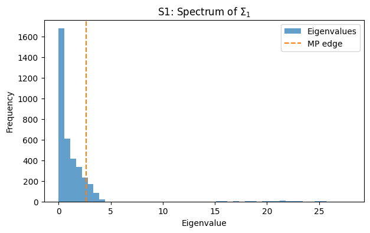

# fjs-dealias-portfolio

De-aliasing the spurious spikes that arise when MANOVA spectra are aliased in high-dimensional regimes yields materially better out-of-sample covariance and risk forecasts than Ledoit–Wolf shrinkage, enabling more reliable portfolio design under market noise. In a balanced one-way design with \(J\) daily replicates per week, the weekly risk of a portfolio with weights \(w\) decomposes into

\[
\mathbb{V}\!\left[\sum_{j=1}^J w^\top r_j\right] = J^2 w^\top \widehat{\Sigma}_1 w + J\, w^\top \widehat{\Sigma}_2 w,
\]

highlighting why both the aliased and de-aliased estimators must target the same \(\widehat{\Sigma}_1, \widehat{\Sigma}_2\) components even when we correct the spike magnitudes.

## Quickstart

```bash
python -m venv .venv
source .venv/bin/activate
make setup
make fmt
make lint
make test
```

## Running the experiments

- **Synthetic (S1/S3)** – `make run-synth`
  - Outputs: `figures/synthetic/s1_histogram.(png|pdf)` , `figures/synthetic/bias_table.csv`, `figures/synthetic/summary.json`.
- **Equity rolling forecast** – `make run-equity`
  - Outputs: `experiments/equity_panel/outputs/` (rolling CSV summaries and variance/VaR figures). Key artefacts include:
    - `experiments/equity_panel/outputs/E3_variance_mse.png` 
    - `experiments/equity_panel/outputs/E4_var95_coverage_error.png` 
    - `experiments/equity_panel/outputs/metrics_summary.csv`
- **Crisis window reruns** – pass `--crisis "YYYY-MM-DD:YYYY-MM-DD"` to `experiments/equity_panel/run.py` to repeat the rolling evaluation on a focused, high-volatility interval. Outputs land in a dedicated `crisis_*/` subdirectory alongside the full-sample results.

Both scripts accept optional `--config` YAML files mirroring the defaults in the corresponding `experiments/*/config.yaml`.

## Reproducing figures

Running the commands above regenerates all main figures and tables in the `figures/` and `experiments/equity_panel/outputs/` directories. The synthetic pipeline emits S1 spectra histograms and S3 bias tables; the equity experiment writes variance/VaR comparison plots (E3/E4) alongside CSV logs of every rolling window.

## Matching targets across estimators

Both the aliased estimator and the de-aliased spike reconstructions are calibrated against the same weekly covariance components. We first compute the balanced MANOVA mean squares \(\widehat{\text{MS}}_1, \widehat{\text{MS}}_2\), then build the weekly covariance through

\[
\widehat{\Sigma}_\text{weekly} = J^2 \widehat{\Sigma}_1 + J \widehat{\Sigma}_2,\qquad \widehat{\Sigma}_1 = \frac{\widehat{\text{MS}}_1 - \widehat{\text{MS}}_2}{J},\quad \widehat{\Sigma}_2 = \widehat{\text{MS}}_2.
\]

De-aliasing only substitutes selected spike magnitudes in \(\widehat{\Sigma}_1\); \(\widehat{\Sigma}_2\) and the aggregation to weekly risk remain unchanged, guaranteeing both paths forecast the same quantity before and after spike adjustments. Ledoit–Wolf operates on the same balanced weekly returns, providing a shrinkage baseline against the identical target.

## Guardrails during de-aliasing

- **δ-buffer:** candidate spikes must exceed the Marčenko–Pastur bulk edge plus a safety buffer before they are considered.
- **Angular stability:** every accepted spike must persist when the search direction \(a\) is rotated by ±η degrees.
- **Cluster merge:** detections with nearby \(\hat{\mu}\) values are merged; the most stable representative is kept.

## Citation

Fan, J., Johnstone, I. M., & Sun, Q. (2018). Eigenvalue shrinkage estimation of large covariance matrices. *Journal of the Royal Statistical Society: Series B (Statistical Methodology)*.

## Citation

Fan, J., Johnstone, I. M., & Sun, Q. (2018). Eigenvalue shrinkage estimation of large covariance matrices. *Journal of the Royal Statistical Society: Series B (Statistical Methodology)*.
